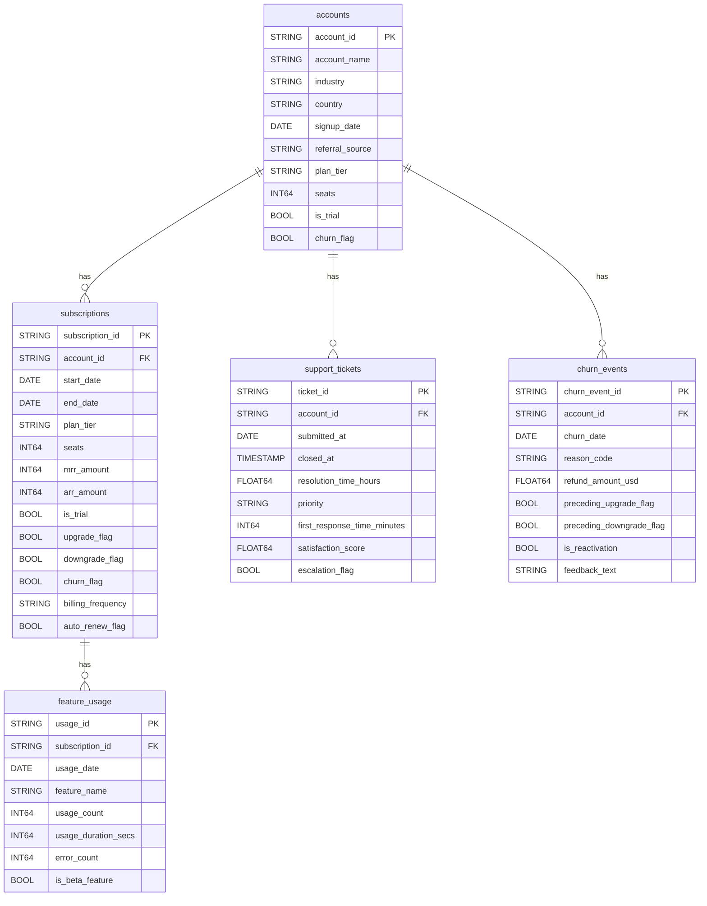

```bash
pip install dbt-bigquery
```

## Raw Schema (`subscriptionchurn.raw`)

Entity-relationship diagram generated from the DDL in [`documentation/raw_tables.csv`](./documentation/raw_tables.csv).

